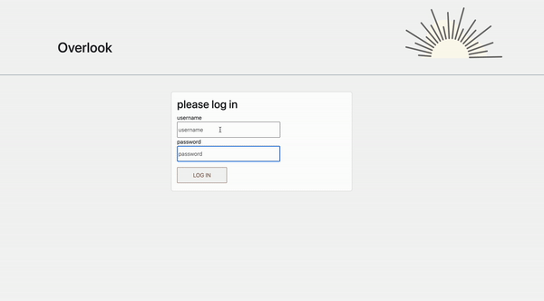

# Overlook

## Abstract:
I built an application that allows users to book a hotel room at the overlook hotel. The user is able to log in to the application (there are 50 different users). The user is able to see the bookings that have already been made and the total amount that has been spent. Available rooms can be seen upon selecting a data and an option room type filter. The user can book a room, which updates the bookings and total amount spent upon returning to their dashboard. The website is fully tab-able and accessible with 0 [Wave](https://wave.webaim.org/extension/) errors and a 100% rating using the LightHouse tool in Google Chrome.

## Installation Instructions:
1. Fork and clone [this repo](https://github.com/espressoGoddess/overlook).
1. Copy the SSH key from the green "Code" button within each repo.
1. In your terminal, use the command `git clone git@github.com:[the link to repo]`.
1. Run `npm install` in the local repository.
1. Do NOT run `npm audit fix --force` when prompted.
1. Open the repo in your text editor to make any changes or inspect code.
1. Run `npm start` in your terminal.
1. Copy and paste the generated `localServer` address that your terminal provides for the front end repo into your browser address bar.
1. Login using `overlook2021` as the password and `customer[any number from 1-50]` as the username. For example `customer34` or `customer2` are good username options.

## Preview of App:

## Context:
This solo project took approximately 15 hours to complete.

## Contributors:
- [Amber Shipley](https://github.com/espressoGoddess)

## Learning Goals:

1. Implement ES6 classes that communicate to each other as needed.
1. Use object and array prototype methods to perform data manipulation.
1. Create a user interface that is easy to use and clearly displays information.
1. Write modular, reusable code that follows SRP (Single Responsibility Principle).
1. Implement a robust testing suite using TDD.
1. Carry out UX workshopping and implement feedback from outside usability test.
1. Work with a local server and make network requests to API endpoints to retrieve and manipulate data.
1. Ensure our app follows best practices for accessibility.
1. Solidify the code review process.

## Technologies Used:
- Fetch API
- Webpack
- Mocha & Chai
- Bootstrap
- LightHouse
- Wave Evaluation
- GitHub Issues & Project Board
- JavaScript
- CSS
- HTML
- NPM packages

## Wins + Challenges:
- #### Wins:
  - I successfully fetched, parsed and displayed data from 3 separate URL sources. I also posted to the API.
  - Implemented a login page for the first time with up to 50 different usernames.
  - Succuessfully navigating and implementing bootstrap, my first time using a CSS library.
  
- #### Challenges:
  - It was challenging to implement a dynamic start date for the calendar to not allow users the ability to book dates that have passed.
  - It was challenging to understand and utilize js-datepicker npm package to begin with. After finishing the app and running the lighthouse audit and wave tool, I found that the package was not accessible. I had to abandon this method and implement the built in date picker at the end.
  - It was challenging to know how and when to catch errors and how to show that to the user
